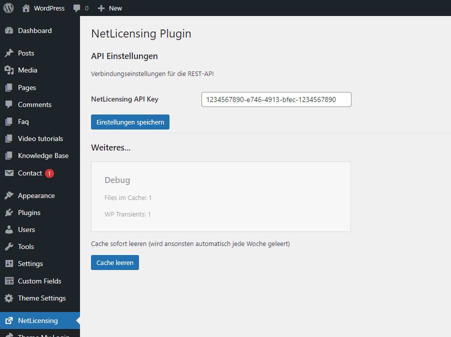

# NetLicensing WordPress Plugin

Mit diesem WordPress-Plugin kann direkt die NetLicensing API von https://netlicensing.io/ angesprochen werden.


## Installation

Um das Plugin zu installieren, erstellen Sie bitte folgenden Ordner "/wp-content/plugins/**netlicensing**" und extrahieren den Zip-Download von GitHub direkt hinein. Das Plugin kann nun im WordPress Backend aktiviert werden. Im Hauptmenu erscheint ein entsprechender Menupunkt "NetLicensing".

Um nun die Schnittstelle nutzen zu können, muss im Plugin ein API-Token hinterlegt werden. Der API-Token hierfür kann im NetLicensing-Backend generiert werden.

## Konfiguration
Im WordPress-Backend kann unter dem Menupunkt "NetLicensing" der API Key hinterlegt werden.



## Einbinden in WordPress (Plugin, Template...)
```
$nl = NetLicensingSystem::getInstance();

// Lizenznehmer anlegen
$nl->createLicensee('PMWE4TSJY','UserID123',true);

// Shop-URL von bestehendem Lizenznehmer abfragen
$user = $nl->getLicenseeById('UserID123');
$url = $user->getShopURL();
```